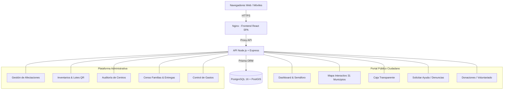

# 🌿 CHOCÓ TRANSPARENTE
### Sistema Departamental de Gestión de Emergencias, Coordinación Humanitaria y Transparencia Pública

> **Gobernación del Chocó • Consejo Departamental de Gestión del Riesgo (CDGRD)**  
> Plataforma tecnológica de trazabilidad de punta a punta, georreferenciación de los 31 municipios, gestión de inventarios humanitarios, entrega de ayudas con evidencia y rendición de cuentas pública en tiempo real.

---

## 🏛️ Propósito y Alcance del Proyecto

**Chocó Transparente** es la respuesta tecnológica y ciudadana para coordinar la asistencia humanitaria en el departamento del Chocó:
1. **Para la Ciudadanía:** Conocer el estado de la emergencia, ubicar albergues y centros de acopio, solicitar ayuda con código de radicado único, postular donaciones y voluntariado, y vigilar cada peso mediante la **Caja Transparente** y el canal de denuncias anónimas.
2. **Para la Gobernación, Alcaldías y Organismos de Socorro:** Control estricto de los 31 municipios, inventario por lotes y código QR, control de duplicados en entregas a familias damnificadas, y trazabilidad financiera con doble aprobación.

---

## 🏗️ Arquitectura del Sistema



---

## 📂 Estructura del Repositorio

```text
choco-transparente/
├── backend/                        # API REST en Node.js, Express & Prisma
│   ├── Dockerfile                  # Construcción multi-stage de producción
│   ├── .dockerignore
│   ├── .env.example
│   ├── prisma/                     # Esquema de base de datos relacional y espacial
│   ├── src/                        # Código fuente modular en TypeScript
│   └── package.json
├── frontend/                       # Aplicación Web React, Vite & TailwindCSS
│   ├── Dockerfile                  # Construcción multi-stage con Nginx
│   ├── .dockerignore
│   ├── .env.example
│   ├── nginx.conf                  # Configuración de Nginx para SPA Routing
│   ├── src/                        # Componentes, vistas y servicios públicos y admin
│   └── package.json
├── script-BD-produccion.sql         # Script limpio DDL + DML base para la Gobernación
├── script-BD-demo.sql               # Script con datos de muestra para testing y demo
├── script-BD.sql                    # Script principal de referencia
├── docker-compose.yml              # Orquestación completa (Postgres/PostGIS + API + Web)
├── docker-compose.prod.yml         # Orquestación para Dokploy con base de datos externa
├── MANUAL_DESPLIEGUE_DOKPLOY.md    # Manual paso a paso de despliegue en VPS con Dokploy
├── .env.example                    # Plantilla de variables de entorno global
└── README.md                       # Documentación principal
```

---

## 👥 Credenciales de Acceso para Pruebas (Testing)

Una vez ejecutado el script [`script-BD-demo.sql`](./script-BD-demo.sql):

| Usuario | Correo Electrónico | Contraseña | Rol / Permisos |
| :--- | :--- | :--- | :--- |
| **Superadministrador** | `admin@chocotransparente.gov.co` | `AdminChoco2026!` | Acceso Global Total (31 Municipios) |
| **Operador de Pruebas** | `test@chocotransparente.gov.co` | `TestChoco2026!` | Coordinación Operativa de Acopio |

---

## ⚡ Despliegue Rápido con Docker Compose

Para levantar todo el ecosistema localmente en 1 solo comando:

```bash
# 1. Clonar el repositorio
git clone https://github.com/tu-usuario/choco-transparente.git
cd choco-transparente

# 2. Copiar variables de entorno
cp .env.example .env

# 3. Levantar contenedores
docker compose up --build -d
```

- **Frontend:** [http://localhost:80](http://localhost:80)
- **Backend API:** [http://localhost:4000/health](http://localhost:4000/health)
- **Base de Datos:** PostgreSQL en el puerto `5432`

---

## 🚢 Despliegue en Servidor VPS con Dokploy

Para desplegar en tu servidor VPS mediante **Dokploy** (sea con base de datos PostgreSQL interna o externa), consulta la guía detallada:

👉 **[MANUAL_DESPLIEGUE_DOKPLOY.md](./MANUAL_DESPLIEGUE_DOKPLOY.md)**

---

## 📜 Scripts de Base de Datos Disponibles

1. **[`script-BD-produccion.sql`](./script-BD-produccion.sql):**
   - Esquema DDL completo con índices espaciales PostGIS.
   - Catálogo oficial de los **31 municipios del Chocó**.
   - Roles institucionales y usuario Superadministrador.
   - **Completamente limpio** (cero registros de prueba, cero beneficiarios ficticios). Listo para la entrega oficial a la Gobernación.
2. **[`script-BD-demo.sql`](./script-BD-demo.sql):**
   - Contiene el esquema completo + datos semilla de prueba (centros de acopio, albergues, stock de kits, afectaciones y usuario de testing) para que el equipo pueda probar la plataforma inmediatamente.

---

## 🛡️ Licencia y Autoridad Institucional

Desarrollado para el Departamento del Chocó y el fortalecimiento de la transparencia en la gestión de emergencias humanitarias.
